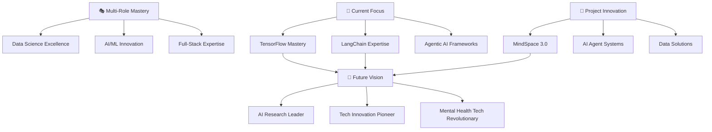

# 🚀 Hey there, I'm Ishika Bhatnagar! 
### *Multi-Role Tech Wizard | AI FullStack Engineer | Data Science Virtuoso*

<div align="center">


[](https://git.io/typing-svg)

</div>

---

## 🌟 About Me

```python
class IshikaBhatnagarCoder:
    def __init__(self):
        self.name = "Ishika Bhatnagar"
        self.roles = [
            "Data Scientist", "Data Analyst", "AI FullStack Engineer",
            "ML Engineer", "Java FullStack Engineer"
        ]
        self.current_project = "MindSpace 3.0"
        self.location = "🇮🇳 India"
        self.specialties = ["Multi-domain expertise", "AI/ML Innovation", "Full-Stack Wizardry"]
        self.learning_focus = ["TensorFlow", "LangChain", "Agentic AI Frameworks"]
        self.quirky_trait = "Has a very long readers block (but codes like lightning!)"
        
    def my_superpower(self):
        return "I can wear 5 different tech hats and still look fabulous! 👑✨"
    
    def current_mission(self):
        return "Building MindSpace 3.0 while mastering the art of agentic AI! 🧠🤖"
    
    def life_motto(self):
        return "Why choose one role when you can master them all? 🎭"

ishika = IshikaBhatnagarCoder()
print(ishika.my_superpower())
print(ishika.current_mission())
print(ishika.life_motto())
```

🎭 **My Multiple Tech Personalities:**
- 📊 **Data Scientist** - Turning chaos into insights, one dataset at a time
- 🔍 **Data Analyst** - Finding needles in data haystacks with surgical precision  
- 🤖 **AI FullStack Engineer** - Building intelligent systems from front to back
- 🧠 **ML Engineer** - Crafting algorithms that learn and evolve
- ☕ **Java FullStack Engineer** - Creating robust enterprise solutions
- ✨ **Innovation Catalyst** - Bridging the gap between ideas and reality

🚀 **What I'm Currently Crafting:**
- 🧠 **Drug Research Platform** - My flagship project revolutionizing drug and its research studies  tech
- 🤖 **Agentic AI Systems** - Multi-agent frameworks with LangChain mastery
- 📊 **Advanced ML Pipelines** - End-to-end machine learning solutions
- 🌐 **Full-Stack AI Applications** - Seamless AI integration across the stack
- 📈 **Data Visualization Masterpieces** - Making data tell compelling stories

---

## 🛠️ My Tech Arsenal & Superpowers

<div align="center">

### 💻 **Core Programming Languages**
<a href="https://www.python.org" target="_blank" rel="noreferrer">  </a>&nbsp;&nbsp;
<a href="https://www.java.com" target="_blank" rel="noreferrer">  </a>&nbsp;&nbsp;
<a href="https://developer.mozilla.org/en-US/docs/Web/JavaScript" target="_blank" rel="noreferrer">  </a>&nbsp;
<a href="https://www.typescriptlang.org/" target="_blank" rel="noreferrer">  </a>&nbsp;&nbsp;
<a href="https://kotlinlang.org" target="_blank" rel="noreferrer">  </a>&nbsp;&nbsp;

### 🤖 **AI & Machine Learning Arsenal**
<a href="https://www.tensorflow.org" target="_blank" rel="noreferrer">  </a>&nbsp;&nbsp;
<a href="https://pytorch.org/" target="_blank" rel="noreferrer">  </a>&nbsp;&nbsp;
<a href="https://scikit-learn.org/" target="_blank" rel="noreferrer">  </a>&nbsp;&nbsp;
<a href="https://opencv.org/" target="_blank" rel="noreferrer">  </a>&nbsp;&nbsp;
<a href="https://pandas.pydata.org/" target="_blank" rel="noreferrer">  </a>&nbsp;&nbsp;
<a href="https://seaborn.pydata.org/" target="_blank" rel="noreferrer">  </a>&nbsp;&nbsp;

### 🌐 **Full-Stack Development**
<a href="https://reactjs.org/" target="_blank" rel="noreferrer">  </a>&nbsp;&nbsp;
<a href="https://nodejs.org" target="_blank" rel="noreferrer">  </a>&nbsp;&nbsp;
<a href="https://spring.io/" target="_blank" rel="noreferrer">  </a>&nbsp;&nbsp;
<a href="https://www.djangoproject.com/" target="_blank" rel="noreferrer">  </a>&nbsp;&nbsp;
<a href="https://flask.palletsprojects.com/" target="_blank" rel="noreferrer">  </a>&nbsp;&nbsp;&nbsp;&nbsp;

### ☁️ **Cloud & DevOps Magic**
<a href="https://aws.amazon.com" target="_blank" rel="noreferrer">  </a>&nbsp;&nbsp;
<a href="https://cloud.google.com" target="_blank" rel="noreferrer">  </a>&nbsp;&nbsp;
<a href="https://www.docker.com/" target="_blank" rel="noreferrer">  </a>&nbsp;&nbsp;
<a href="https://kubernetes.io" target="_blank" rel="noreferrer">  </a>&nbsp;&nbsp;
<a href="https://firebase.google.com/" target="_blank" rel="noreferrer">  </a>&nbsp;&nbsp;
<a href="https://heroku.com" target="_blank" rel="noreferrer">  </a>&nbsp;&nbsp;

### 📊 **Data & Visualization Sorcery**
<a href="https://www.mongodb.com/" target="_blank" rel="noreferrer">  </a>&nbsp;&nbsp;
<a href="https://www.postgresql.org" target="_blank" rel="noreferrer">  </a>&nbsp;&nbsp;
<a href="https://www.mysql.com/" target="_blank" rel="noreferrer">  </a>&nbsp;&nbsp;
<a href="https://www.oracle.com/" target="_blank" rel="noreferrer">  </a>&nbsp;&nbsp;
<a href="https://cassandra.apache.org/" target="_blank" rel="noreferrer">  </a>&nbsp;&nbsp;
<a href="https://www.chartjs.org" target="_blank" rel="noreferrer">  </a>&nbsp;&nbsp;
<a href="https://canvasjs.com" target="_blank" rel="noreferrer">  </a>&nbsp;&nbsp;

### 🔧 **Development Tools & Platforms**
<a href="https://git-scm.com/" target="_blank" rel="noreferrer">  </a>&nbsp;&nbsp;
<a href="https://www.w3.org/html/" target="_blank" rel="noreferrer">  </a>&nbsp;&nbsp;
<a href="https://www.w3schools.com/css/" target="_blank" rel="noreferrer">  </a>&nbsp;&nbsp;
<a href="https://developer.android.com" target="_blank" rel="noreferrer">  </a>&nbsp;&nbsp;
<a href="https://postman.com" target="_blank" rel="noreferrer">  </a>&nbsp;&nbsp;

</div>

---

## 📊 GitHub Analytics & Achievements Showcase

<div align="left">

<p align="left">  </p>

<p align="left"> <a href="https://twitter.com/athera1323" target="blank"></a> </p>

<p align="left"> <a href="https://github.com/ryo-ma/github-profile-trophy"></a> </p>


### 🔥 Contribution Heatmap


</div>

---

## 🏆 Featured Projects & Innovations

<div align="left">

### 🧠 **MindSpace 3.0** 
```javascript
const mindSpace = {
  status: "🚧 In Active Development",
  tech: ["AI/ML", "Full-Stack", "Mental Health Tech"],
  description: "Revolutionary mental wellness platform powered by AI",
  impact: "🌟 Transforming mental health support through technology",
  innovation: "🧠 AI-driven personalized wellness experiences",
  vision: "Making mental health care accessible and intelligent"
}
console.log("Building the future of mental wellness! 🚀");
```

### 🤖 **Agentic AI Framework Mastery**
```python
class AgenticAIInnovation:
    def __init__(self):
        self.frameworks = ["LangChain", "TensorFlow", "Custom Agents"]
        self.capability = "Multi-agent intelligent systems"
        self.vision = "Creating AI that thinks, learns, and collaborates"
        self.current_focus = "Autonomous problem-solving systems"
    
    def innovate(self):
        return "Building tomorrow's intelligent agents today! 🤖✨"
    
    def impact(self):
        return "Revolutionizing how humans and AI collaborate! 🌟"
```

### 📊 **Advanced Data Science Solutions**
```python
class DataScienceMagic:
    def __init__(self):
        self.tools = ["Python", "ML/DL", "Advanced Visualization"]
        self.specialty = "Turning data chaos into actionable insights"
        self.superpower = "Making numbers tell compelling stories"
        self.approach = "End-to-end data pipeline mastery"
    
    def transform_data(self):
        return "From raw data to business intelligence! 📈"
```

**💡 Portfolio Showcase:** [ishika1323.github.io/landing-page](https://ishika1323.github.io/landing-page/)

</div>

---

## 🎯 My Learning Journey & Future Vision



### 🎯 **Current Learning Expedition:**
- 🧠 **Advanced TensorFlow** - Deep learning architectures and optimization
- 🦜 **LangChain Mastery** - Building sophisticated AI agent workflows
- 🤖 **Agentic AI Frameworks** - Multi-agent systems and intelligent automation
- 📊 **Advanced Data Engineering** - Scalable data pipelines and architecture
- 🌐 **Full-Stack AI Integration** - Seamless AI-powered applications

### 🌟 **Vision & Goals:**
- 🏥 **Revolutionize Mental Health Tech** through MindSpace 3.0
- 🤖 **Pioneer Agentic AI Solutions** for real-world problems
- 📊 **Lead Data Science Innovation** in emerging technologies
- 🌍 **Impact Millions of Lives** through technology and compassion
- 🎓 **Mentor Next Generation** of multi-role tech professionals

---

## 🏅 Competitive Programming & Platform Mastery

<div align="left">

### 🚀 **Coding Platforms**
<p align="left">
<a href="https://twitter.com/athera1323" target="blank"></a>
<a href="https://linkedin.com/in/ishika-bhatnagar-67020a17b" target="blank"></a>
<a href="https://kaggle.com/ishika1323" target="blank"></a>
<a href="https://www.codechef.com/users/ishika1323" target="blank"></a>
<a href="https://www.hackerrank.com/ishikabhatnagar2" target="blank"></a>
<a href="https://codeforces.com/profile/athera1323" target="blank"></a>
<a href="https://www.leetcode.com/ishikabhatnagar1323" target="blank"></a>
<a href="https://auth.geeksforgeeks.org/user/ishika1323" target="blank"></a>
</p>

### 🎯 **Achievement Highlights:**
- 🏆 **Multi-Platform Problem Solver** - Active across 8+ coding platforms
- 📊 **Data Science Competitor** - Kaggle enthusiast and dataset explorer
- 🧠 **Algorithm Mastermind** - Solving complex problems across domains
- 🎯 **Consistent Performer** - Regular participation and skill development
- 🌟 **Full-Stack Competitor** - From algorithms to application development

</div>

---

## 🌐 Let's Connect & Create Magic Together!

<div align="left">

[](https://ishika1323.github.io/landing-page/)
[](https://drive.google.com/file/d/18Lju5qktua7_VZhD9EKHRkJ_o6Fxq4m-/view?usp=sharing)
[](mailto:ishikabhatnagar23@gmail.com)
[](https://linkedin.com/in/ishika-bhatnagar-67020a17b)
[](https://twitter.com/athera1323)

**💬 I'm passionate about collaborating on:**
- 🧠 **Mental Health Tech Solutions** - Technology for wellness and therapy
- 🤖 **Agentic AI Systems** - Multi-agent frameworks and intelligent automation
- 📊 **Advanced Data Science Projects** - ML/DL applications and insights
- 🌐 **Full-Stack AI Applications** - End-to-end intelligent systems
- 🏥 **Healthcare Technology** - AI-powered medical and wellness solutions
- 🎓 **Educational Technology** - Learning platforms and AI tutoring systems

**🎯 Open to:**
- 🚀 **Innovative Project Partnerships** - Building the future together
- 🤝 **Cross-Domain Collaborations** - Bridging AI, data science, and development
- 💡 **Research Opportunities** - Advancing the frontiers of technology
- 🌟 **Mentorship Exchange** - Learning and teaching in the tech community
- 🎭 **Multi-Role Projects** - Leveraging diverse skill sets for maximum impact

</div>

---

## 🎨 Fun Facts & Personality Quirks

<div align="left">

### 🎭 **The Real Ishika:**
- 📚 I have a **very long readers block** but my code reads like poetry! 
- 🎭 I wear **5 different tech hats** daily and somehow they all fit perfectly
- ☕ My debugging sessions are powered by curiosity (and premium coffee)
- 🧠 I think in **multiple programming languages** simultaneously 
- 🤖 Completed working on **MindSpace 3.0** while my own mind races with innovative ideas
- 📊 I can find patterns in data faster than I can decide what to binge-watch
- 🌟 **Multi-role mastery** isn't just a skill, it's my technological superpower!

### 🎪 **Current State of Mind:**
```python
class IshikaMode:
    def __init__(self):
        self.current_projects = ["Drug Research Platform", "Agentic AI", "Data Magic"]
        self.energy_level = "Infinitely Curious & Caffeine-Powered"
        self.readers_block = True  # But coding block = False!
        self.multitasking_ability = "Legendary Status Achieved"
        self.innovation_mode = "Always ON"
    
    def daily_routine(self):
        roles = ["Data Scientist", "AI Engineer", "Full-Stack Dev", 
                "ML Engineer", "Java Developer"]
        for role in roles:
            print(f"Currently being awesome as: {role} ✨")
        return "Just another day of multi-role mastery! 🎭"
    
    def ask_me_about(self):
        expertise = ["All ML/DL Algorithms", "Java Full-Stack", 
                    "Agentic AI", "Mental Health Tech"]
        return f"I can discuss: {', '.join(expertise)} 🧠"

ishika_mode = IshikaMode()
print(ishika_mode.daily_routine())
print(ishika_mode.ask_me_about())
```

### 🌟 **My Tech Philosophy:**
> *"Why limit yourself to one role when technology is an interconnected ecosystem? 
> Every challenge is just a puzzle waiting to be solved with the right combination of skills!"* - Ishika

### 🎯 **Fun Challenge for You:**
*Can you guess which role I'm playing just by looking at my latest commit? 
Hint: I probably switched roles at least 3 times while building MindSpace 3.0!* 😄

</div>

---

<div align="left">


### 🚀 *"Mastering multiple roles, creating singular impact"*

**⭐ If my multi-domain journey inspires you, let's connect and create something amazing together!** 

**🎯 Current Mission: Building my very own Drug Research platform while exploring the frontiers of Agentic AI! 🧠**


### 📊 **Network & Impact Stats:**


---

**🔮 "In a world of specialists, be the generalist who connects all the dots and creates magic!"**

*Ready to revolutionize tech across multiple domains? Let's code, analyze, innovate, and transform together! 🌟*

### 💫 **Ask me about:**
- 📊 **All the ML/DL Algorithms** and their real-world applications
- ☕ **Java full-stack development** and enterprise solutions  
- 🤖 **AI agent frameworks** and LangChain implementations
- 📈 **Data science methodologies** and advanced visualization techniques
- 🧠 **Mental health technology** and MindSpace 3.0 development
- 🎭 **Multi-role career strategies** in the tech industry

**Ready to build the future? Let's make it happen! 🚀✨**

</div>
